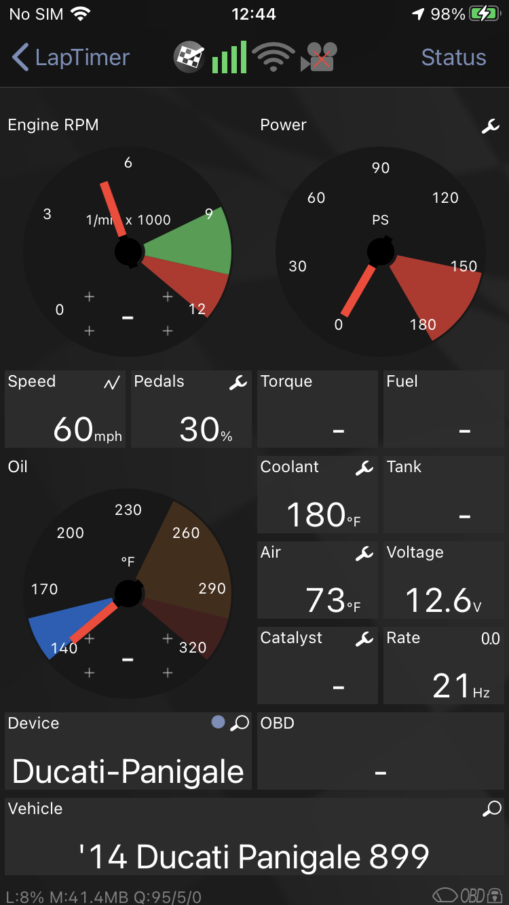
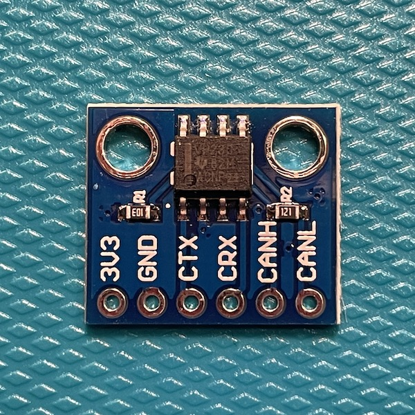
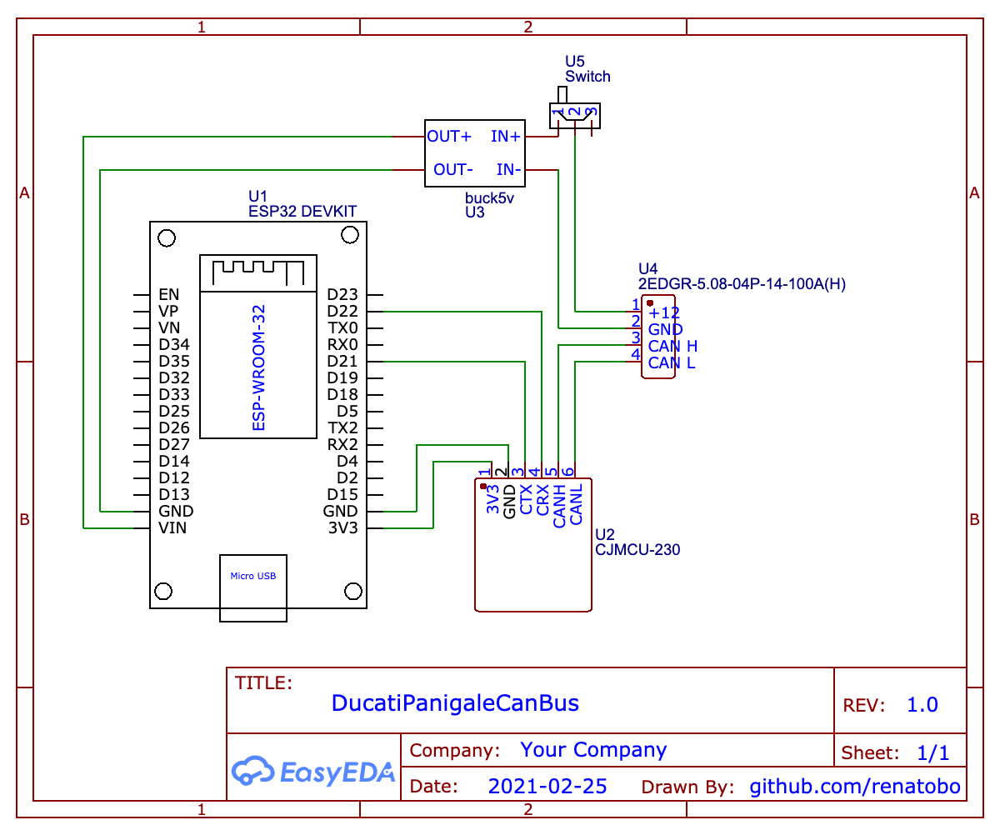

# DucatiPanigaleCanBus

- [What is DucatiPanigaleCanBus?](#what-is-ducatipanigalecanbus)
- [Setup of Harry Lap Timer](#setup-of-harry-lap-timer)
- [Hardware](#hardware)
- [Schematics](#schematics)
- [Building the software in Platform IO and Arduino IDE](#building-the-software-in-platform-io-and-arduino-ide)
- [Credits](#credits)

## What is DucatiPanigaleCanBus?

If you are a motorcycle rider/racer, you might want to log data from your bike to improve your riding style.
This project connects a small device based on ESP32 to the CAN Bus on a Ducati Panigale (or other Ducati bikes with similar ECU), it monitors and extracts RPM/speed/gear/temperature, and it broadcasts the collected data via Bluetooth Low Energy to Harry Lap Timer 'Engine sensor'.

This code is specialized for messages generated by the Mitsubishi ECU used in some models like

* Panigale (899/959/1199/1199S/1199R/1299/1299S/R and Superleggera)
* Multistrada 1200 (2010 to 2014)
* Diavel, Diavel Strada, Diavel DS

Right now this is compatible only with BLE which is the preferred option if you are using an iOS device with Harry Lap Timer: extending to regular bluetooth or WiFi/TCP-IP is not complicated, yet not on the priority list right now - please log a request if you are really interested and willing to help in the extension.

## Setup of Harry Lap Timer

At this time, the script running on Harry Lap Timer needs to be made available with instructions [that are described in the HLT developer forum](http://forum.gps-laptimer.de/index.php).

There is no further configuration required on HTL: once the script is available and your ESP32 flash and connected, HLT will discover the device (based on the device ID naming convention, the BLE Service, and the Characteristics IDs defined in the ESP32 code and in the LUA script)

## Hardware

Parts: Ux refers to the schematic reported below. Links to sources are examples, these are very generic componebts.

* U1: A generic ESP32
* U2: [A CANBUS transceiver, such as one based on SN65HVD230](https://www.amazon.com/gp/product/B07ZT7LLSK). Be careful to source a genuine part
* U3: [Buck converter 12V to 5V](https://www.amazon.com/gp/product/B076P4C42B) to power ESP32 from the CANBUS directly
* U4: [4 PINs adapter for Ducati DDA port (male)](https://www.aliexpress.com/item/4001007307044.html)

Misc parts from your HW bin

* U5: small switch (to cut power when not needed) inline with the Input power
* heat shrink tube to protect the cable from the 4 PINs adapter

## Schematics

The most complicated and hard to source part is the 4 pin adapter to the DDA port (check [monocilindro.com for a nice article on connections](https://www.monocilindro.com/2018/08/26/ducati-monster-797-obd2-dda-diagnostic-connector-and-communication/)

- pin1: +12
- pin2: Ground
- pin3: CAN high
- pin4: CAN low

You can also buy an ODBII adapter and use th ODBII pin schema convention.

In a nutshell:

- Pin1 (+12) and Pin2 (ground) connect to the buck converter to power the ESP32
- Pin3 and Pin4 carry the CANBUS signal going to the transceiver

## Building the software in Platform IO and Arduino IDE

This project is best handled with Platform.io. Nonetheless, it uses the Arduino framework so you can use the Arduino IDE as well.

Steps required to compile this in the Arduino IDE

- copy content of `src` and `include` into your sketch folder
- perform a `git clone https://github.com/timurrrr/arduino-CAN` in the sketch folder, or copy a zip file from github directly
- move the content of `arduino-CAN/src` in the main folder of your sketch

## Credits

Other projects that inspired this work are

- The excellent work performed by MrCanBus [in this thread](https://www.ducati.ms/threads/canbus-data-on-you-android-device-via-bluetooth.337705/) and his [CanBus sniffer](https://github.com/MrCanBus/MTS1200-CANBUS)
- Collective decoding of Ducati CANBUS messages ([spreadsheet](https://docs.google.com/spreadsheets/d/1-NJ9OlGQYTGMzBzwDPYn-aI_7_ign9SCiscKZufx3Uw/edit?pli=1#gid=1950998351))
